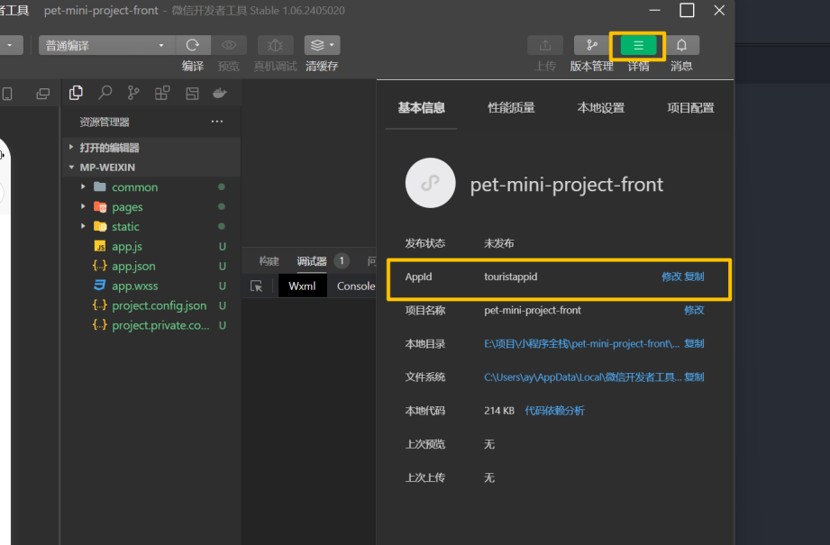
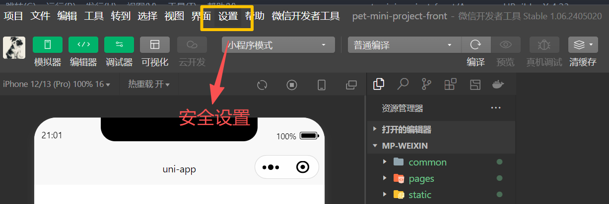
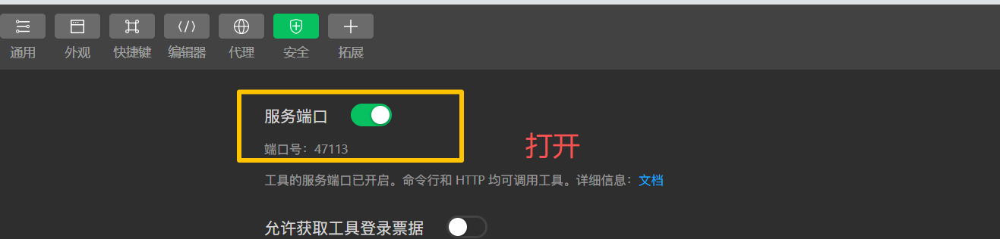
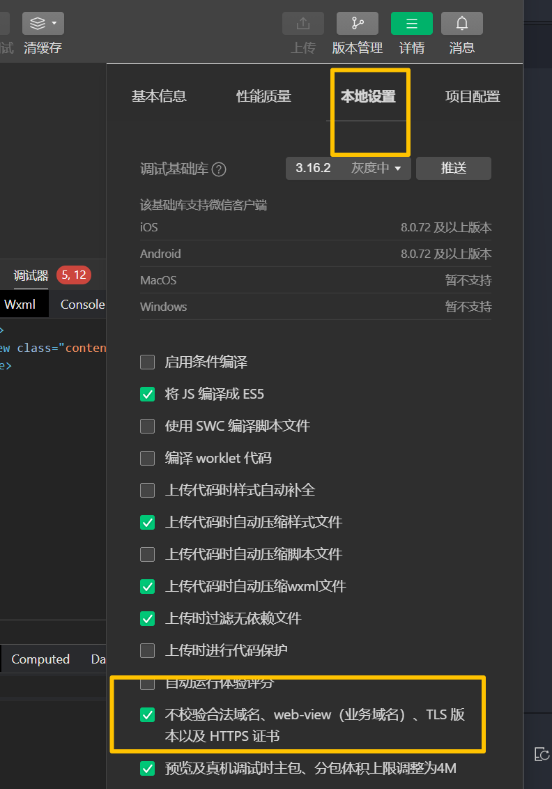

# 项目开发步骤

## 1 新建项目

### 1.1 VSCode 方法

```bash
# 通过 uni-app 官方模板创建（Vue3 版本）
npx degit dcloudio/uni-preset-vue#vite 项目名称

# 进入项目并安装依赖
cd 项目名称
npm install
```

### 1.2 HBuilderX 方法

HBuilderX 菜单栏 → **文件** → **新建** → **项目** → 选择 `uni-app`，勾选 `Vue3` 版本，填写项目名称即可。

## 2 配置小程序 appId

在 `manifest.json` 的 `mp-weixin` 节点下配置微信小程序 AppID：

```json
"mp-weixin": {
    "appid": "wx7a804c75d979be99"
}
```

AppID 可在 [微信公众平台](https://mp.weixin.qq.com/) → 开发管理 → 开发设置 中获取。

## 3 微信开发者工具配置









## 4 更改配置

### 4.1 增加 mergeVirtualHostAttributes 配置

在 `manifest.json` 的 `mp-weixin` 节点下开启：

```json
"mp-weixin": {
    "appid": "wx7a804c75d979be99",
    "mergeVirtualHostAttributes": true
}
```

**作用**：允许父组件在使用自定义组件时设置的 `class`、`style` 等属性，与子组件内部根节点的属性**合并**，实现样式透传。开启后可以直接给自定义组件添加样式：

```vue
<!-- 外部 class/style 会合并到组件内部根节点 -->
<my-card class="mt20" style="position: relative;" />
```

## 5 创建 tabBar 页面

在 `pages.json` 中配置页面路径和 tabBar：

```json
{
    "pages": [
        { "path": "pages/index/index", "style": { "navigationBarTitleText": "首页" } },
        { "path": "pages/service/service", "style": { "navigationBarTitleText": "服务" } },
        { "path": "pages/me/me", "style": { "navigationBarTitleText": "我的" } }
    ],
    "tabBar": {
        "color": "#999",
        "selectedColor": "#ffce2c",
        "backgroundColor": "#fff",
        "list": [
            {
                "pagePath": "pages/index/index",
                "text": "首页",
                "iconPath": "static/common/images/home.png",
                "selectedIconPath": "static/common/images/home-active.png"
            },
            {
                "pagePath": "pages/service/service",
                "text": "服务",
                "iconPath": "static/common/images/service.png",
                "selectedIconPath": "static/common/images/service-active.png"
            },
            {
                "pagePath": "pages/me/me",
                "text": "我的",
                "iconPath": "static/common/images/me.png",
                "selectedIconPath": "static/common/images/me-active.png"
            }
        ]
    }
}
```

> 页面文件需在 `pages/` 目录下对应创建，如 `pages/index/index.vue`。

## 6 安装 uView Plus

### 6.1 VSCode 方法

前往 [uView Plus 插件市场](https://ext.dcloud.net.cn/plugin?id=14656) 下载 zip 包，解压后将 `uview-plus` 文件夹放到项目 `uni_modules/` 目录下。

### 6.2 HBuilderX 方法

HBuilderX 打开项目 → 插件市场搜索 `uView Plus` → 点击下载安装，自动放入 `uni_modules/`。

### 6.3 使用方法

**配置 easycom**（`pages.json`）：

```json
"easycom": {
    "autoscan": true,
    "custom": {
        "^u--(.*)": "@/uni_modules/uview-plus/components/u-$1/u-$1.vue",
        "^up-(.*)": "@/uni_modules/uview-plus/components/u-$1/u-$1.vue",
        "^u-([^-].*)": "@/uni_modules/uview-plus/components/u-$1/u-$1.vue"
    }
}
```

**引入组件样式**（`App.vue`）：

```vue
<style lang="scss">
    @import "@/uni_modules/uview-plus/index.scss";
</style>
```

**引入 SCSS 变量**（`uni.scss`）：

```scss
@import '@/uni_modules/uview-plus/theme.scss';
```

**引入全局配置**（`main.js`）：

```js
import uviewPlus from '@/uni_modules/uview-plus'
import { createSSRApp } from 'vue'
export function createApp() {
    const app = createSSRApp(App)
    app.use(uviewPlus)
    return { app }
}
```

> 样式需 **两处引入**，分工不同：`App.vue` 中的 `index.scss` 提供组件实际 CSS 样式；`uni.scss` 中的 `theme.scss` 提供 SCSS 变量供页面引用。

配置完成后即可直接在模板中使用组件：

```vue
<template>
    <u-button type="primary">按钮</u-button>
    <u-input placeholder="请输入" />
</template>
```

## 7 uni_modules 下的组件 安装 以及 使用方法

`uni_modules` 是 uni-app 的插件目录，存放从插件市场安装的组件，随项目源码一起提交，不能加入 `.gitignore`。

### 7.1 安装组件

#### 方式一：HBuilderX 下载

HBuilderX 打开项目 → 插件市场搜索 → 下载安装，自动放入 `uni_modules/`。

#### 方式二：手动下载

前往 [uni-app 插件市场](https://ext.dcloud.net.cn/) 下载 zip 包，解压后放到 `uni_modules/` 下同名文件夹即可。

### 7.2 使用方法

通过 `pages.json` 的 `easycom` 自动扫描注册（`autoscan: true`），符合命名规范的组件可直接在模板中使用，**无需手动 import**：

```vue
<template>
    <u-button type="primary">按钮</u-button>
    <uni-icons type="search" />
</template>
```

## 8 首页开发

### 顶部导航栏
